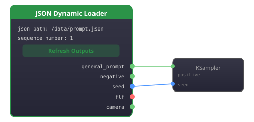
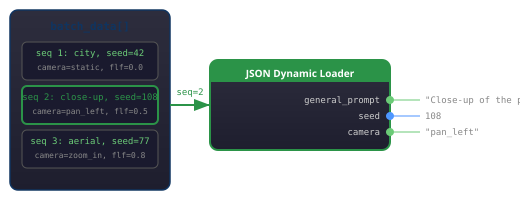

<p align="center">
  
</p>

<p align="center">
  
  
</p>

A single ComfyUI node that reads any JSON file and **automatically creates output slots** for every key it finds. No hardcoded outputs &mdash; when your JSON structure changes, just click Refresh.

## Features

- **Auto-discovery** &mdash; reads JSON keys and exposes them as named outputs
- **Type detection** &mdash; `INT`, `FLOAT`, `STRING` types with colored connectors
- **Batch support** &mdash; `sequence_number` input for `batch_data` arrays
- **Connection-safe refresh** &mdash; adding new keys preserves existing links
- **Workflow persistence** &mdash; keys, types, and connections survive save/reload

## Installation

### ComfyUI Manager
Search for **JSON Dynamic Loader** in the ComfyUI Manager registry.

### Manual
```bash
cd ComfyUI/custom_nodes/
git clone https://github.com/ethanfel/ComfyUI-JSON-Dynamic.git
# Restart ComfyUI
```

## Usage

1. Add **JSON Dynamic Loader** node to your workflow
2. Enter a `json_path` and `sequence_number`
3. Click **Refresh Outputs**
4. Outputs appear named after your JSON keys with correct types
5. Connect to downstream nodes

<p align="center">
  
</p>

## Type Handling

| JSON type | Output type | Connector |
|:---|:---|:---|
| `42` (integer) | `INT` | Blue |
| `3.14` (float) | `FLOAT` | Teal |
| `"hello"` (string) | `STRING` | Pink |
| `true` / `false` | `STRING` (`"true"` / `"false"`) | Pink |

## JSON Format

### Flat JSON (single segment)

For simple use cases, the node reads keys directly from the root object. The `sequence_number` input is ignored.

```json
{
  "general_prompt": "A cinematic scene...",
  "seed": 42,
  "flf": 0.5,
  "camera": "pan_left"
}
```

### Batch JSON (multiple segments)

For multi-shot workflows, wrap entries in a `batch_data` array. Each entry is a **segment** representing one shot/scene with its own settings. The `sequence_number` input selects which segment to read.

```json
{
  "batch_data": [
    {
      "sequence_number": 1,
      "general_prompt": "Wide establishing shot of a city",
      "seed": 42,
      "camera": "static",
      "flf": 0.0
    },
    {
      "sequence_number": 2,
      "general_prompt": "Close-up of the protagonist",
      "seed": 108,
      "camera": "pan_left",
      "flf": 0.5,
      "my_custom_key": "only on this segment"
    },
    {
      "sequence_number": 3,
      "general_prompt": "Aerial drone shot over rooftops",
      "seed": 77,
      "camera": "zoom_in",
      "flf": 0.8
    }
  ]
}
```

### Segment lookup

The node resolves which segment to read using this logic:

1. **Match by `sequence_number` field** &mdash; scans `batch_data` for an entry whose `sequence_number` matches the input
2. **Fallback to array index** &mdash; if no match is found, uses `sequence_number - 1` as the array index (clamped to bounds)
3. **No `batch_data`** &mdash; reads keys from the root object directly

This means segments don't need to be in order and can have gaps (e.g. 1, 5, 10). Each segment can have different keys &mdash; click **Refresh Outputs** after changing `sequence_number` if the keys differ between segments.

<p align="center">
  
</p>

## String & Path Utility Nodes

Four additional nodes that replace common multi-node chains for string and path operations.

### Path Join (`utils/path`)

Joins 1–6 path segments using `os.path.join` with automatic normalization.

| Input | Type | Notes |
|:---|:---|:---|
| `segment_1` | STRING | Required |
| `segment_2` – `segment_6` | STRING | Optional |

**Output:** `path` (STRING)

### String Format (`utils/string`)

Python format-string templating (`{0}/{1:04d}.{2}`) with up to 8 connected inputs. Handles zero-padding, type conversion, and arbitrary templates in one node.

| Input | Type | Notes |
|:---|:---|:---|
| `template` | STRING | Format string, e.g. `{0}/{1:04d}` |
| `v0` – `v7` | any | Optional values to substitute |

**Output:** `string` (STRING)

### String Extract (`utils/string`)

Extracts substrings with 3 modes:

| Mode | Description |
|:---|:---|
| `split_take` | Split on delimiter, take part at index (negative indices supported) |
| `between` | Extract text between two delimiters |
| `filename_parts` | Decompose path into dirname / basename / extension |

**Outputs:** `result`, `dirname`, `basename`, `extension` (all STRING)

### String Switch (`utils/string`)

Boolean-based selection with built-in default values.

| Input | Type | Notes |
|:---|:---|:---|
| `condition` | BOOLEAN | Required |
| `on_true` / `on_false` | any | Optional connected values |
| `default_true` / `default_false` | STRING | Fallback widget values |

**Output:** `result` (any)

When a connected input (`on_true`/`on_false`) is present it takes priority; otherwise the corresponding `default_*` string widget is used.

## License

[Apache 2.0](LICENSE)
